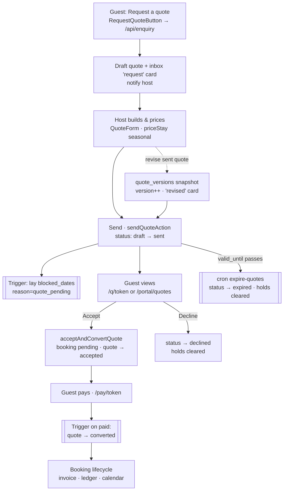

# Quotes — lifecycle flow

> How a guest's request for a price becomes a **sent quote**, then an **accepted
> quote**, then a **booking**. A quote is an *offer*: it never moves money on its
> own — accepting it auto-creates a normal `bookings` row (`origin='quote_converted'`)
> so date-blocking, policy snapshots, VAT, payment and ledger all reuse the booking
> machinery (see [booking.md](booking.md), [payments-ledger.md](payments-ledger.md)).
> **Not the manual booking form** — that commits a real booking immediately; a quote
> is accepted first. See memory `feedback-quote-vs-booking-forms-distinct`.
>
> Audited 2026-07-13 (deep pass). Canonical pricing: `apps/web/lib/pricing` (`priceStay`,
> wrapped by `lib/pricing/quote.ts` `computeStayPricing`). Numbering: `Q-NNNN` via
> `next_quote_number`. Doc-numbering scheme: [reference-doc-numbering-scheme].

Conventions: amounts stored in full Rand units; the guest-facing pages gross VAT
up to match what they'll be charged at booking. A quote's `total_amount` is
always the **seasonally-computed** figure (the engine, never a flat rate).

---

## Data model

**`quotes`** (`20260524000001_quotes_invoices_addons.sql`; `listing_id`→`property_id`
by the `20260617000300` rename):

| Group | Columns |
|---|---|
| Ownership | `host_id`, `property_id`, `guest_id` (SET NULL — often null until accept), `guest_name/email/phone` |
| Number/token | `quote_number` (`Q-NNNN`, global seq) · `accept_token` (22-char, gates the public page) |
| Stay | `check_in`, `check_out`, `headcount`, `guests_breakdown` jsonb, `scope` (`whole_listing`\|`rooms`) |
| Money | `base_amount`, `cleaning_fee`, `addons_total`, `total_amount`, `currency` · `price_mode` (`itemised`\|`single`) |
| Discount | `discount_type` (`percent`\|`fixed`), `discount_value`, `discount_reason`, `discount_amount` |
| Deposit terms | `deposit_type` (`deposit`\|`full`\|`reserve`), `deposit_pct`, `deposit_amount`, `balance_amount`, `balance_due_days` |
| Policy | `policy_snapshot` jsonb (frozen cancellation policy) |
| Lifecycle | `status` `draft\|sent\|accepted\|declined\|expired\|converted` · `previous_status` · `version` · `valid_until` · `sent_at`/`accepted_at`/`declined_at`/`converted_at` · `converted_booking_id` · `deleted_at` (soft) |
| Guest note | `notes` (host→guest message shown on the quote) |
| Links | `conversation_id` (inbox thread) · `looking_for_post_id` |

Related: `quote_rooms` (per-room base/cleaning), `quote_addons` (`kind` custom\|catalog\|age),
`quote_versions` (immutable pre-edit snapshots + `reason`), `quote_notes` (host-only internal
thread), `quote_view_events` (cookieless open tracking), `blocked_dates.quote_id`
(`reason='quote_pending'` soft holds), `messages.quote_id`+`quote_version_no` (thread cards).

> **Status note:** there is **no `viewed` status** — "viewed" is UI-derived from
> `quote_view_events`. A draft's `total_amount` is already the seasonal engine price,
> so a "suggested price" shown in the inbox card is real, not a placeholder.

---

## 1. Request a quote (visitor/guest) — enquiry, not a quote yet
- **Trigger:** visitor taps "Request a quote" on `property/[slug]/RequestQuoteButton.tsx`
  (a `FormModal`: DateRangePicker + party steppers + a room **dropdown** + their message).
  Actor: guest.
- **Route:** `POST /api/enquiry` → `lib/enquiry/create-enquiry.ts` `createEnquiry`
  (public, never throws; honeypot + validation). Signed-in guests are redirected to the
  portal thread; leads get an in-place thank-you + "create my password" claim.
- **DB writes:** a `conversations` row (`is_enquiry`), a **`quotes` row `status='draft'`**
  (numbered, `notes:null`), `quote_rooms` (if room-scoped), and two `messages`: the guest's
  note (non-system) then the `quote_request` **system card**; plus a host auto-reply.
- **Side-effects:** notification `quote_request_host` (→ host) · inbox card `request`.
- **Next:** → Step 2 (host builds it). Also reachable: host creates a quote from scratch
  (`dashboard/quotes/new`) or via **looking-for respond** (`QuoteForm` embedded variant).

## 2. Build / price the quote (host) — `dashboard/quotes/QuoteForm.tsx`
- **Trigger:** host opens the draft (from the inbox card "Complete & send quote") or a new
  quote. Actor: host. Page variant = left-rail 4-step (Confirm stay · Price · Terms · Review)
  + autosave drafts; embedded variant for looking-for.
- **Functions/files:** `dashboard/quotes/actions.ts` — `priceQuoteAction` (calls
  `computeStayPricing`→`priceStay`, **seasonal-aware**), `createQuoteAction`/`updateQuoteAction`.
  Editing a **sent** quote is a *revision*: `snapshotQuoteVersion` freezes the prior state into
  `quote_versions`, bumps `version`, posts a `quote_revised` card.
- **DB writes:** `quotes` (amounts, discount, deposit terms, `policy_snapshot`), `quote_rooms`,
  `quote_addons`. Internal notes → `quote_notes` (`addQuoteNoteAction`, host-only).
- **Next:** → Step 3 (send).

## 3. Send the quote (host) → soft-holds the calendar
- **Trigger:** "Send" → `sendQuoteAction(id, validDays)` (default **3**, presets 1/3/7/until-checkin).
  Actor: host.
- **Logic:** `draft`→`sent`, sets `sent_at` + `valid_until = now + validDays`.
- **DB writes:** `quotes.status='sent'`. **Trigger `trigger_quote_status_change`** lays per-night
  `blocked_dates` (`reason='quote_pending'`, `quote_id`, per-room when scope=rooms).
- **Side-effects:** inbox card `issued` (`quote_sent`) · conversation `pipeline_stage` advances ·
  for looking-for-linked quotes: `looking_for_responses` upsert + notification
  `looking_for_quote_received` (**the only quote event that emails today**). status(sent).
- **Next:** → Step 4 (guest views) · branches: decline (5) · expire (6) · revise (Step 2).

## 4. Guest views & responds — two surfaces, one convert path
- **Public token page** `q/[id]/[token]/page.tsx` — no login; gated by `accept_token`
  (service role). Renders `FinancialDocument` (line items, VAT grossed, **banking** while live,
  PDF link `q/[id]/[token]/pdf`). Records `quote_view_events` (→ host sees "Seen N×";
  `looking_for_quote_viewed` for looking-for quotes).
- **Portal (signed-in)** `portal/quotes/[id]/page.tsx` — matched by `guest_id` OR email (admin
  read), with **Download PDF**, accept/decline, and an accepted-but-unpaid **"Pay now & confirm"**
  CTA + "View your trip". Overview surfaces a "Quotes to review" stat.
- **Accept:** `guestAcceptQuoteAction` (token) / `acceptMyQuoteAction` (portal) → both call
  `lib/quotes/accept-convert.ts` `acceptAndConvertQuote` and return the booking's `pay_token`
  so the guest is offered **"Continue to pay"** (`/pay/{token}`) — neither path dead-ends.
- **Next:** accept → Step 7 · decline → Step 5.

## 5. Decline (guest) or void (host)
- **Decline:** `guestDeclineQuoteAction`/`declineMyQuoteAction` → `status='declined'`,
  `declined_at`, conversation `pipeline_stage='declined'`, unread-for-host `quote_declined`
  card. Trigger **clears the `blocked_dates` holds**.
- **Void (host):** `softDeleteQuoteAction` sets `deleted_at` (blocked for converted quotes).

## 6. Expire (system) — clears leaked holds ✅ fixed 2026-07-13
- **Trigger:** hourly pg_cron **`expire-quotes`** (`20260713140000_expire_quotes_cron.sql`):
  `status='sent' AND valid_until < now()` → `status='expired'`. Actor: system(cron).
- **Why it matters:** before this, expiry was lazy display-only while the DB stayed `sent`,
  so every ignored quote held its nights on the calendar **forever**. The status flip fires
  `trigger_quote_status_change`, whose terminal branch **DELETEs** the quote's `blocked_dates`.
- **Side-effects:** status(sent→expired) · calendar holds released. Runtime paths already
  date-guarded at read/accept, so this only fixes persisted status + the calendar release.

## 7. Accept → booking created (pending payment)
- **Functions/files:** `lib/quotes/accept-convert.ts` `acceptAndConvertQuote` (service role,
  idempotent on `converted_booking_id`).
- **Logic/DB writes:** inserts a `bookings` row (`origin='quote_converted'`, `status='pending'`,
  `payment_status='pending'`, `quote_id`), clones `quote_rooms`→booking rooms +
  `quote_addons`→`booking_addons`, seeds a pending **deposit** `payments` row +
  `recomputeBookingPaymentState`, snapshots cancellation policy (`snapshot_booking_policies`),
  links the booking to the conversation. Quote → **`accepted`** (NOT `converted`) so the hold
  persists until paid.
- **Side-effects:** unread `quote_accepted` card · booking board shows a pending booking ·
  status(sent→accepted).
- **Next:** → Step 8 (pay).

## 8. Pay → convert (guest pays the deposit/balance)
- **Trigger:** guest pays via `/pay/[token]` (Paystack/PayPal/EFT). Actor: guest.
- **Logic:** on the booking reaching a confirmed/paid state, trigger
  **`on_quote_booking_confirmed`** (`20260605000004`) flips the source quote
  `accepted`→**`converted`**, stamps `converted_at`/`converted_booking_id`; the booking's own
  calendar block takes over from the quote hold (which the terminal trigger releases).
- **Side-effects:** inbox card `converted` (booking card) · invoice auto-created on confirm
  (`on_booking_confirmed_create_invoice`) · ledger/receipt via the booking flow. status(converted).
- **Next:** the rest is the [booking lifecycle](booking.md).

---

## Notifications & email (registry `lib/notifications/registry.ts`)
| Event | Who | Channels | Email |
|---|---|---|---|
| `quote_request_host` | host | in-app/push | — |
| `looking_for_quote_received` | guest | in-app/push | `looking_for_quote_received` (only emailing quote event) |
| `looking_for_quote_viewed` | host | in-app | — |

Dashboard-quote **sent/accepted/declined post immutable inbox cards only** (no email).
⚠️ **Gap:** a plain property-enquiry quote does not email the guest a link, and the
`looking_for_quote_received` template has no matching `emails/templates/*.tsx` file yet —
candidates for the next pass.

## Inbox cards — `components/inbox/ThreadQuoteCard.tsx` + `quote-thread.ts`
Event-sourced: one immutable card per lifecycle message via `quoteCardKind`
(`request`/`issued`/`accepted`/`declined`/`converted`); `latestIssuedVersionByQuote` greys
superseded versions. The card shows the **room/listing cover + name**, the **requester's
message**, and either the host's **"Suggested price · auto-calculated"** or, for the guest's
still-draft request, a **"Waiting for the quote"** panel.

---

## Flow (happy path + branches)

**Visual:** [`quotes-flow.svg`](quotes-flow.svg) (theme-aware SVG — the same
diagram, viewable/printable on its own). Source of truth below:

---

## Verified this pass (2026-07-13)
- ✅ Numbering, seasonal pricing engine, convert-to-booking, RLS, inbox cards.
- ✅ **Fixed:** `expire-quotes` cron (leaked-hold bug) — registered live; validity default reconciled.
- ✅ **Fixed:** portal accept now returns `pay_token` → "Continue to pay" (no dead-end); portal
  detail parity (banking via PDF, VAT, accepted-unpaid pay CTA); Overview "Quotes to review" stat.
- ✅ **Enriched:** request-a-quote modal (DateRangePicker + room dropdown + live summary); inbox
  card (cover image, requester's message, suggested-price/waiting).
- ⚠️ **Not yet verified live:** guest-side inbox card + portal quote pay-CTA (code mirrors the
  verified host/token paths; build-green). Quote-sent email for non-looking-for quotes: **not built**.
